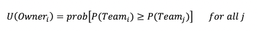
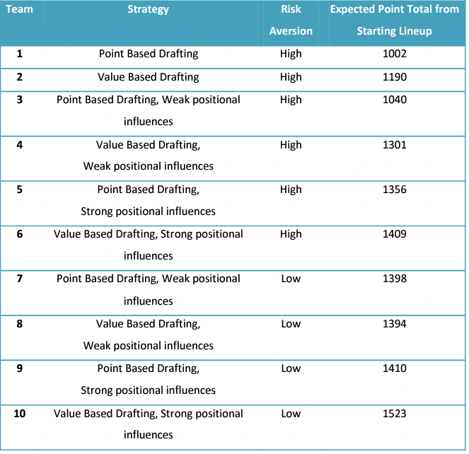

# Fantasy Draft

## [Win your fantasy auction draft](https://fantasyfootballanalytics.net/2013/06/win-your-fantasy-football-auction-draft.html)

### Strategy

1. Draft offensice starting lineup first
   - Send less on kickers and defense
     - Less predictable and score fewer points
2. Spend most (or even all) of your cap on starters
    - [Harvard analysis](https://harvardsportsanalysis.files.wordpress.com/2012/04/fantasyfootballdraftanalysis1.pdf) showed most players over-spend on bench and under-spend on key starters
    - GOAL: Maximize your starting lineup's projected points
3. For starters, pick the players with the highest sum of projected pointe while minimizing risk
4. For bench players, pick the players with a high ceiling
    - That way, one or more of your bench players has a chance to outperform starters or be a solid replacement
    - Be willing to accept higher risk for bench players than for starters
5. Give players more weight if they have a **high dropoff**
    - Player is projected to score many more points than the next best players at the dame position

### User Inputs

- **Season:** which season of projections to use.
- **Week:** which week(s) of projections to use.
- **Number of Teams:** the number of teams in your league.
- **League Cap:** the cap available for each team at the beginning of the draft.
- **Cap Reserved for Bench:** how much cap to reserve for your bench players.
- **Total Players on Roster:** the total number of players on roster, including bench players.
- **Number of Starters by Position:** how many players in your starting lineup at each position.
- **High Rank:** the rank of the highest tier of players for inflating costs.
- **Low Rank:** the rank of the lowest tier of players for deflating costs.
- **High Rank Cost Multiplier:** the inflation/deflation multiplier for players with a High Rank (or higher).
- **Mid Rank Cost Multiplier:** the inflation/deflation multiplier for players with between the High Rank and Low Rank.
- **Low Rank Cost Multiplier:** the inflation/deflation multiplier for players with a Low Rank (or lower).
- **AAV:** source of average auction values.
- **League Scoring:** source of scoring settings.
- **Positions:** which positions of players to include in calculations.
- **VOR Baseline:** the position rank set to be the “typical replacement player” for each position.  We set the default baseline VOR value as the number of players drafted at each position within the top 100 picks, based on ADP on MyFantasyLeague.com.  You can modify the VOR baseline values.  For info on how to select a typical replacement for each position, see here.
- **Impute Replacement-Level Points for Missed Games:** Select yes to add points of the “typical replacement player” for each game a player is expected to miss due to suspensions.  For example, if Player X is projected for 180 points over 12 of a possible 16 games, and our calculation determines 10 points per game as replacement-level production, the points column will show 220 points (180 + 4*10).  Select no to avoid imputing replacement-level points for missed games.  Projected number of games missed comes from ProFootballFocus.com.
- **Calculation Type:** the type of average to calculate: mean, weighted average, or robust average.  By default, a weighted average is used with analysts weighted by their historical accuracy.  You can modify the weights in the weighted average.  The mean is equivalent to a weighted average where all analysts are equally weighted (weight = 1).  The robust average gives less weight to outliers (crazy projections).
- **Analysts:** Select which analysts to include and, if weighted average, the weights for each analyst (i.e., how much weight to give each source of projections when calculating projected points).  For instance, if you want to exclude ESPN projections, you would give them a weight of 0. If you want to give Yahoo projections twice the weight of CBS, you would give Yahoo a weight of 2 and CBS a weight of 1.  The default weights reflect historical accuracy (higher = more accurate).  Note that FantasyPros shows a default weight of zero because we already include all of their sources in our projections, so it would be double counting to give them a weight above 0.  You can certainly do so, though, if you’d like.  FantasyFootballNerd also shows a default weight of zero because it uses the same projections as FantasyData.
- **Scoring Settings:** specify the number of points for each statistical category and position.

### Sidebar

- **Maximum Risk Tolerance:** Selects the maximum risk allowed for any player to be considered for inclusion in the optimal starting lineup. Players’ risk levels have a mean of 5 and a standard deviation of 2 (see below for more info on how risk is calculated).
- **Remaining Cap for Starters:** How much cap you have remaining to spend on starters.
- **Players You Drafted:**  Select all players you’ve already drafted (click “Pick” button next to player or type player’s name).
- **Other Players Drafted:** Select all players that other teams have drafted (click player’s name or type player’s name).

### Output

- **Lineup with Highest Points:** Players with highest sum of projected points within your league cap and risk tolerance.
- **Lineup with Highest Floor:** Players with highest sum of projected floor within your league cap and risk tolerance.
- **Lineup with Highest Ceiling:** Players with highest sum of projected ceiling within your league cap and risk tolerance.
- **Pick:** Click “Pick” button next to player to add to “Players You Drafted”.
- **Rank:** Overall rank by VOR
- **Player (Team):** Player name and team. Click player’s name to add to “Other Players Drafted”.
- **Pos:** Position.
- **VOR:** Value Over Typical Replacement Player. Used to rank players across positions. Calculated by comparing players’ projected points to a “typical” replacement player at the same position (determined by VOR baseline values). For more info on how VOR is calculated, see here.
- **Points:** Average projected points for a player across analysts.
- **Ceiling:** A player’s upside, calculated as the 90th percentile of a player’s projected points across analysts.
- **Floor:** A player’s downside, calculated as the 10th percentile of a player’s projected points across analysts.
- **ECR Rank:** Expert Consensus Ranking from FantasyPros.
- **Pos Rank:** Position rank.
- **AAV:** Average auction value.
- **Dropoff:** The “dropoff” in projected points for the next best 2 players at the same position.
- **Risk:** Risk of injury and degree of uncertainty of players’ projected points, calculated as the average of: 1) injury risk from Sports Injury Predictor, and 2) the standard deviation of the players’ projected points and rankings across analysts. Standardized within position to have a mean of 5 and a standard deviation of 2 (higher values reflect greater risk).

---

## [How Fantasy Football is Like Stock Picking](https://fantasyfootballanalytics.net/2015/03/fantasy-football-is-like-stock-picking.html)

- When picking players for your fantasy team, your goal is to pick players that others undervalue
- Predicting that they will *outperform* their expectations
- [Crowd-averaged fantasy football projections are more accurate than any individuals projections](https://fantasyfootballanalytics.net/2016/03/best-fantasy-football-projections-2016-update.html)
- Diversification
  - Drafting a QB and WR from the same team exposes you to considerable risk
  - However some position pairs may be uncorrelated or negatively correlated (i.e., TE/RB)
  - [Correlation matrix](http://rotoviz.com/2014/10/correlation-matrix-answers-every-question-youve-ever-dfs-stacking/) of all positions
  - Value-based tools for [auction drafts](http://apps.fantasyfootballanalytics.net/?app=lineupoptimizer) and [identifying sleepers](https://fantasyfootballanalytics.net/2014/06/identify-sleepers-using-wisdom-crowd.html)
  - Ultimate goal is to draft players that provide the most projected points and the smallest downside risk

---

## Optimizing draft strategies in Fantasy Football

- Conditionally optimal auction draft strategy
  - Points-based
  - Value-based
  - Risk-averse
  - Risk-neutral
  - Value-based bidding in s risk-neutral scenerio best overall auction strategy
  - Howeever, in a drift with multiple risk-neutral bidders, bidding with risk aversion was a conditionally optimal strategy
- Auction Draft
  - Owners randomly defined in order
  - Nominate players
  - Each team bids on players
    - slightly modified English auction
  - Highest bid retains player
  - Online draft portal provides an estimated valuation for the player
  - Because each owner needs to fill his roster, the draft consists on a series of auctions which affect one another
  - Salary cap

### Draft Strategy

- $200 salary cap
- QB x 2
- RB x 3
- WR x 5
- TE x 2
- Starters v bench - get numbers
- Points
  - TD: 6
  - Passing yards x 0.04
  - Russing / receiving yards x 0.1
  - Thrown interception -2

### Utility function

- Maximize projected point output
- Owners currently draft with high amounts of risk aversion
- Over-spend on low-performing bench players
- Under-spend on high performing all-star players
- Owners tend to nominate players in order of highest expected return
- Must bid in one-doller increments

### Draft Strategies

#### Best available player

#### Meeting the needs of the team

#### Value-Based Drafting (Bryant 2001)

---

### Conclusions

- Fantasy owners often appear too risk-averse
  - Difference between the coefficient of the regression of fantasy auction prices and fantasy value and calculated risk

---

## [A Player Selection Heuristic for a Sports League Draft](https://www.academia.edu/download/40516386/A_Player_Selection_Heuristic_for_a_Sport20151130-3610-1efdcqb.pdf)

> MJ Fry, AW Lundberg, JW Ohlman | Journal of Quantitative Analysis in Sports

- 

---

## [The Value-Based Drafting method](https://www.espn.com/fantasy/football/ffl/story?page=nfldk2k10vbd)

> Christopher Harris

- 

---